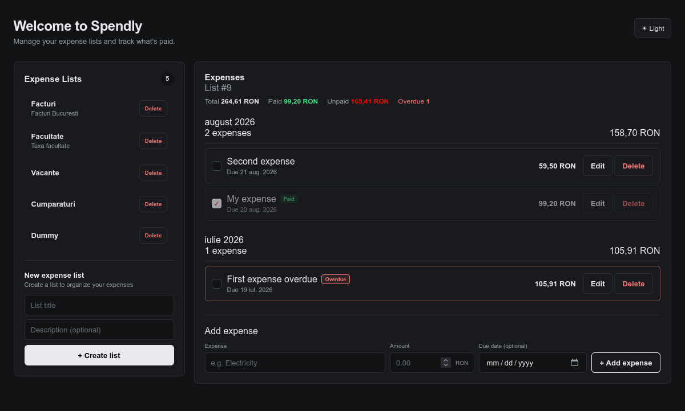
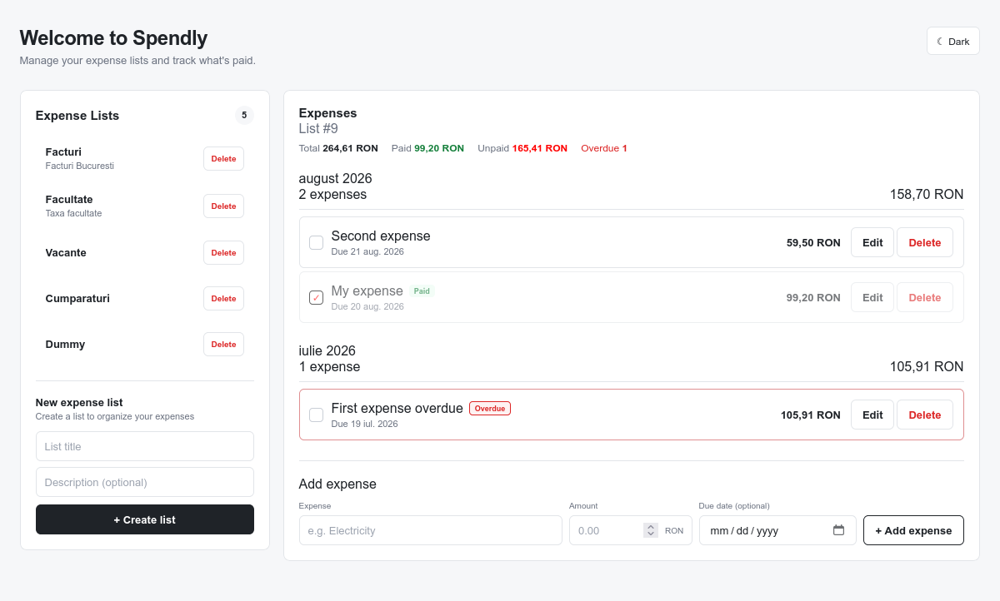

# 💸 Spendly

> A simple, clean expense tracking application.

Spendly helps you organize your expenses into lists, track due dates,
and see at a glance what's paid, unpaid, or overdue.

---

# ✨ Features

## 🗂️ Expense Lists

Organize expenses into separate lists — one for bills, one for a trip, one for groceries, whatever fits.

Features:

- Create a list with a title and optional description
- View all lists at a glance
- Select a list to view its expenses
- Delete a list you no longer need

---

## 📆 Expenses Grouped by Month

Expenses within a list are automatically grouped by month, each with its own subtotal, so spending is easy to scan at a glance.

Features:

- Set an amount and an optional due date per expense
- Automatic monthly grouping and subtotal calculation
- Edit or delete any expense
- Mark an expense as paid or unpaid with a single click

---

## ⏰ Paid, Unpaid & Overdue Tracking

Every list shows a running summary of where your money stands.

Features:

- Total, paid, unpaid, and overdue totals per list
- Automatic overdue detection for unpaid expenses past their due date
- Visual paid state (checked, struck-through) vs. overdue state (highlighted)


## 📸 Sneak peek

| Dark Mode | Light Mode |
|-----------|------------|
|  |  |

---

# 🏗️ Tech Stack

| Layer    | Technologies                                          |
|----------|-------------------------------------------------------|
| Frontend | React, TypeScript, Vite, CSS                          |
| Backend  | Java, Spring Boot, Spring Data JPA, Hibernate, Lombok |
| Database | PostgreSQL, DBeaver                                   |
| Security | Spring Security                                       |              

---

# 🚀 Getting Started

## Backend

```bash
cd backend
./mvnw spring-boot:run
```

Runs on `http://localhost:8080` by default.

## Frontend

```bash
cd frontend
npm install
npm run dev
```

Runs on `http://localhost:5173` by default. If your frontend runs on a different port, update `allowedOrigins` in the backend's `WebConfig`.

---

# 🌟 Highlights

- 🗂️ Multiple expense lists
- 📆 Expenses grouped by month with subtotals
- ⏰ Automatic overdue detection
- ✅ One-click paid/unpaid toggle
- 📊 Per-list totals (paid, unpaid, overdue)
- 🌗 Light & Dark mode
- ⚡ Built with React, TypeScript & Spring Boot
